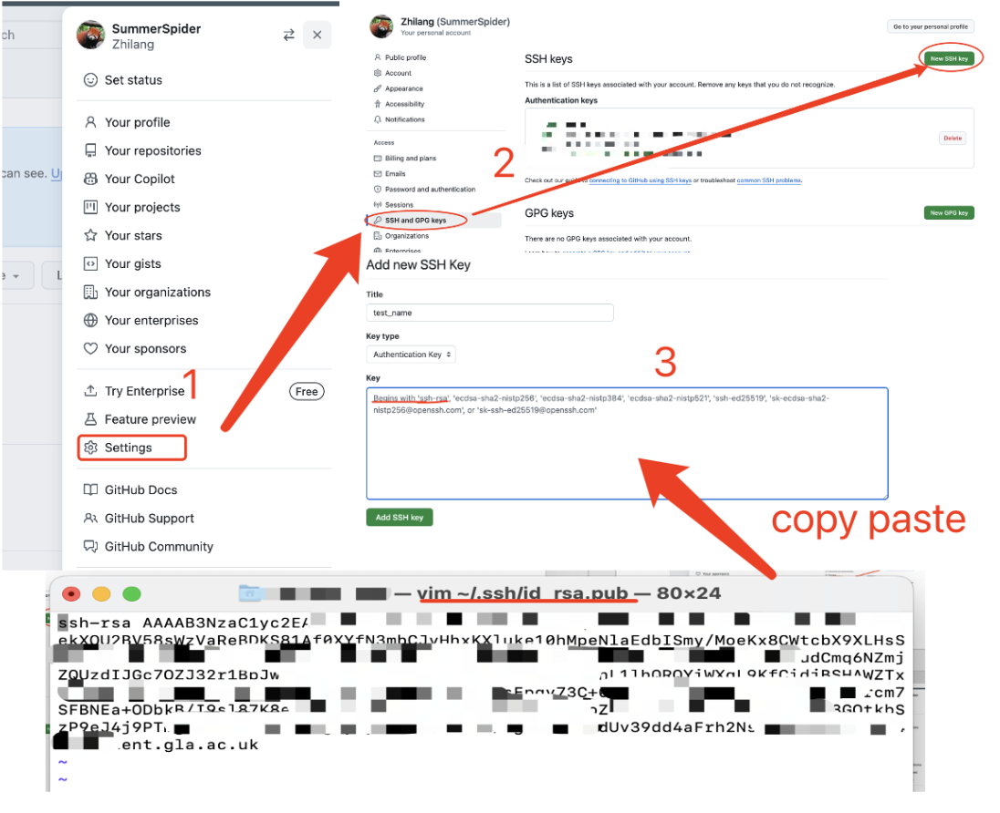
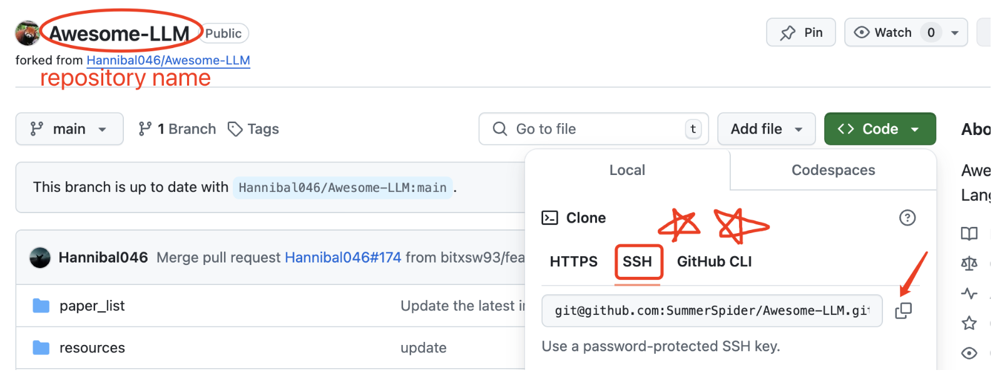
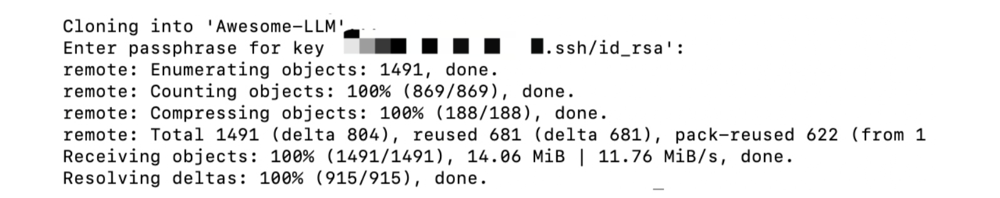
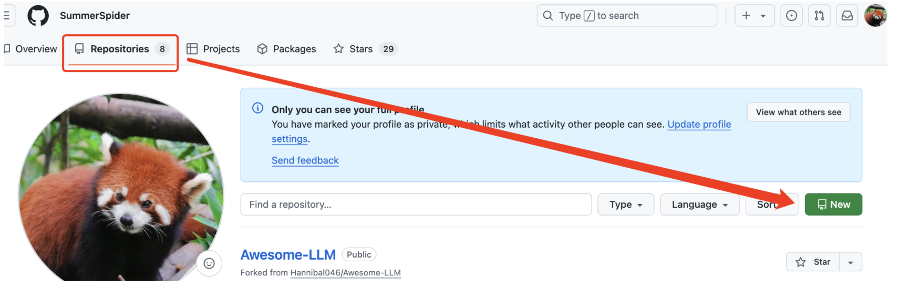
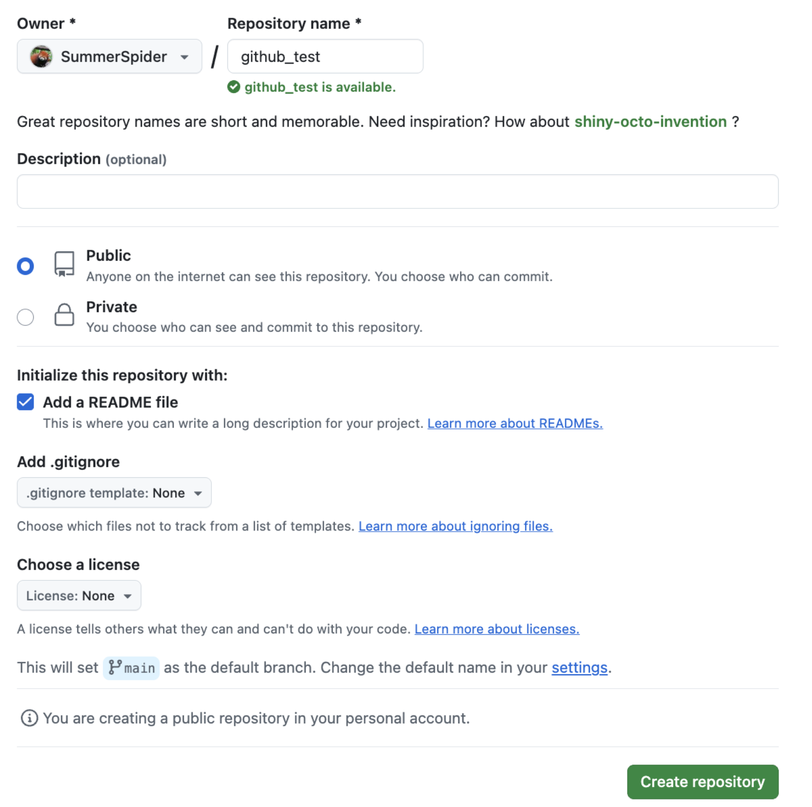
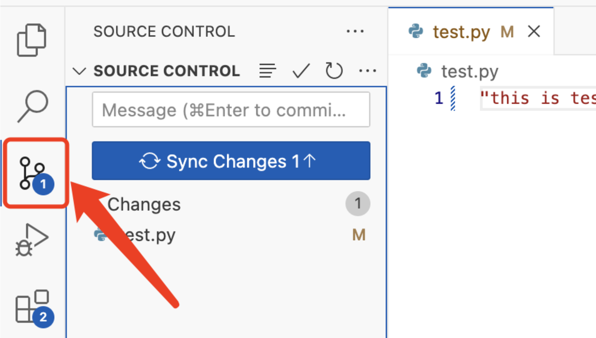
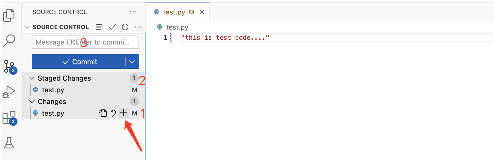
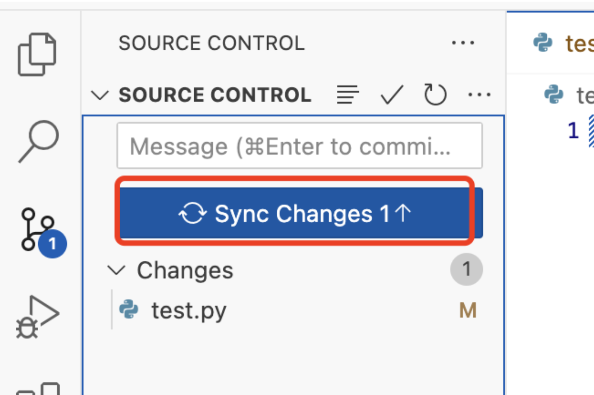

# Introduction to Git and Github

**by Zhilang Xia**

## Content

- [What is Git and Github?](#what-is-git-and-github)
- [How to learn others work in Github?](#how-to-learn-others-work-in-github)
- [Start with Git](#Start-with-Git)
  - [Basical operation](#Basical-operation)
- [Clone](#clone)
- [Pull your own project](#pull-your-own-project)
- [Connecting Visual Studio Code to GitHub](#connecting-visual-studio-code-to-github)

## What is Git and Github?

1. Git : A version control software for managing code changes.

2. Github: A web-based platform for hosting and sharing Git repositories.

3. Three main functions of Git:

   **Commit**: 

   Records changes made to your code each time you commit, creating a history of edits.

   **Repository**:

    A project folder. When Git is initialized, the folder becomes a repository that tracks changes.

   **Branch**: 

   Allows you to create separate parts or versions of a project for different developments.

4. Typically, Git repositories are initialized locally, which limits collaboration. GitHub enables you to host repositories online, making it easier to collaborate with others.

## How  to learn others work in Github?

1. star: The number of "favorites" a project has. This indicates how many people have favorited the project and can be a useful gauge of the project's community influence.
2. readme: An introductory document in Markdown format that provides an overview of the project..
3. license: If the license is MIT or Apache, you can freely use the project as long as you retain the original copyright information in your code. For other licenses, carefully check the author’s usage requirements.
4. commits: Provides information on file updates, including specific details and timestamps.
5. issues:  A place to ask questions or raise problems with the project. Issues can be marked as open (unresolved) or closed (resolved).

## Start with Git

### Initialization

Creating an account on GitHub. Then open the computer terminal, input the following command:

1. Configuring Git with your name and email for global use:

   `git config --global user.name "xxxx"`

   This name will be attached to all your commits as the author.

   `git config --global user.email "xxxx@xx.com"`

   This email will also be attached to all your commits and is typically visible on platforms like GitHub.

2. Creating SSH (Secure Shell) key:

   `ssh-keygen -t rsa -C "xxxx@xx.com"`

3. Creating a password to access your SSH key

   Output:

   ``Generating public/private rsa key pair.`` 

   `Enter file in which to save the key (/Users/hk/.ssh/id_rsa):`

4. Getting your public SSH key

   `vim ~/.ssh/id_rsa.pub`

5. In your Github account:

   

6. Verifying the link 

   `ssh -T git@github.com`

   outcome:

   `Hi SummerSpider! You've successfully authenticated, but GitHub does not provide shell access.`

**Once your SSH key is added to GitHub, you can clone, pull, and push repositories without needing to re-enter your credentials(username & password) each time.**

##  Clone

1. Navigate to the target folder.

2. Open the project terminal.

3. Clone the project by URL:

    `git clone git@github.com:SummerSpider/Awesome-LLM.git`

   

4. Finish

   

### Pull your own project

1. Creating a repository in Github

   

2. Automatically creating a README file with the project name (you can edit it later if needed).

   

3. Creating a folder locally and initialize it in terminal

   `git init`

4. Checking the current branch in the local repository 

   `git branch` 

   *Make sure the branch name matches the one used in your push command and the GitHub branch.*

5. Renaming branch as main

   `git branch -m main`

6. Connecting the local repository to the GitHub repository by URL.

   `git remote add origin git@github.com:SummerSpider/XXX.git`

7. Pulling files from the GitHub repository to your local environment

   `git pull origin main`

8. Push updated files from your local environment to GitHub

   `git add file.format` 

   choose the file(s) that have been modified.

   `git commit -m "add a new document"` 

   commit with a descriptive message

   `git push -u origin main` 

   push changes to GitHub

### Connecting Visual Studio Code to GitHub

1. Open the current folder by Visual Studio Code

   (I add a test python file to this folder)

2. Enter the **source control** section

   

3. click the "+" stage changes (1) , then we can commit (2), with message (3).

   

4. Push commit to your branch in Github.

   

C. PullRequest 

Detailed instructions are available for your reference.

https://docs.github.com/en/pull-requests/collaborating-with-pull-requests

